# UniFormer & UniFormerV2 论文笔记

Author: <a href="https://yusijin02.github.io/">Sijin Yu</a>

## 1. Information

- **Uniformer**

>**标题**: UniFormer: Unified Transformer for Efficient Spatiotemporal Representation Learning
>
>**arXiv URL**: https://arxiv.org/abs/2201.04676
>
>**code**: https://github.com/Sense-X/UniFormer
>
>**期刊/会议**: ICLR2022
>
>**发表时间**: 2022 年 01 月

- **UniformerV2**

>**标题**: UniFormerV2: Spatiotemporal Learning by Arming Image ViTs with Video UniFormer
>
>**arXiv URL**: https://arxiv.org/abs/2211.09552
>
>**code**: https://github.com/OpenGVLab/UniFormerV2
>
>**期刊/会议**: ICCV2023
>
>**发表时间**: 2022 年 11 月

---

## 2. Abstract (UniFormer)

- 在高维的视频中学习丰富的**时空特征表示**具有挑战性, 因为在视频的每帧之间, 存在**大量的局部冗余**和**复杂的全局冗余**.
- 关于此, 最近的主流框架有: **3D CNNs** 和 **ViTs**.
- 3D CNNs 可以高效地整合局部内容, 以**降低局部冗余**, 但是因为其感受野有限, **无法降低全局冗余**.
- ViTs 可以通过自注意力机制**降低全局冗余**, 但是因为其盲目地比较所有 tokens, **无法降低局部冗余**.
- 我们提出一种新式框架 **Unified transFormer (UniFormer)**, 集成了 CNN 和 ViT 的优点, 并且在计算消耗和正确率之间取得了很好的平衡.
- 与传统的 transfomers 不同, 通过在浅层和深层分别学习局部和全局 token affinity [⚠️注: token affinity (词单元亲和力) 度量了两个 token 之间的关联性], 我们的 **relation aggregator** (关系聚合器) 可以**同时处理时空冗余和依赖关系**.

- 我们在主要的 video benchmarks 上做了实验. 在只用 ImageNet-1k 预训练的情况下, UniFormer 在 Kinetics-400 上获得了 82.9% 的准确率, 在 Kinetics-600 上获得了 84.8% 的准确率, 同时需要的 GELOPs 比其它 sota 模型少了 10 倍 [⚠️注: GELOP 指每秒十亿次浮点运算]. UniFormer 在 Something-Something V1 上获得了 60.9% 的正确率, 在 Something-Something V2 上获得了 71.2% 的正确率.

## 3. Methods (UniFormer)

### 3.1 Overview

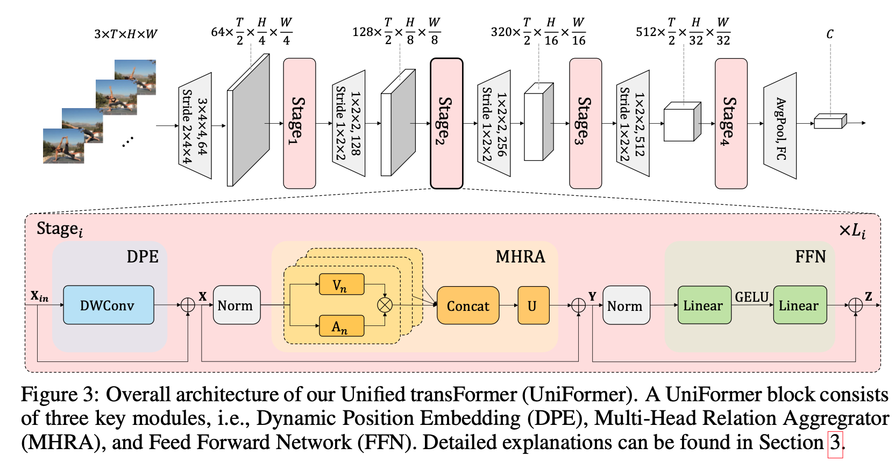

- 由 **CNN** 层 (灰色梯形) 和 **transformer** 层 (粉色圆角矩形) 组成.

- 一个 transformer 层 (**Stage**) 由若干个 **UniFormer 块**组成.

- 一个 UniFormer 块包含三个主要模块:

  - **DPE**: Dynamic Position Embedding, **动态位置包埋**.
  - **MHRA**: Multi-Head Relation Aggregator, **多头关系聚合器**.
  - **FFN**: Feed Forward Network, **全连接层**.

  具体为:
  $$
  \textbf{X}=\text{DPE}(\textbf{X}_{in})+\textbf X_{in}
  $$

  $$
  \textbf Y = \text{MHRA}(\text{Norm}(\textbf X))+\textbf X
  $$

  $$
  \textbf Z = \text{FFN}(\text{Norm}(\textbf Y))+\textbf Y
  $$

  其中, $\textbf X_{in}\in \mathbb R^{3\times T\times H\times W}$.

### 3.2 Dynamic Position Embedding (DPE)

$$
\text{DPE}(\textbf X_{in})=\text{DWConv}(\textbf X_{in})
$$

$\text{DWConv}(\cdot)$ 是 0 填充的简单 3D depthwise 卷积.它的输出不改变

### 3.3 Multi-Head Relation Aggregator (MHRA)

- 给定一层的输入张量: $\textbf X \in \mathbb R^{C\times T\times H\times W}$.

- 将其 reshape 成一个 tokens 的序列: $\textbf X\in\mathbb R^{L\times C}$. 这里 $L=T\times H\times W$.

- 一层 MHRA 有 $N$ 个 Relation Aggregator (RA). (即 $N$ 头). 以 $R_n(\cdot)$ 指代第 $n$ 个.

- 在一个 $R_n(\cdot)$ 里的行为:
  $$
  R_n(\textbf X)=A_n  V_n(\textbf X)\in\mathbb R^{L\times \frac C N}
  $$

  - $V_n(\cdot)$ 是一个全连接层, 输出形状是 $\mathbb R^{L\times\frac CN}$.

  - $A_n\in \mathbb R^{L\times L}$ 表示 token affinity (词单元亲和力). 它**在浅层时用于提取局部亲和力, 在深层时用于提取全局亲和力**. 即: MHRA 分为 **Local MHRA** 和 **Global MHRA**.

    对于 **Local MHRA**:

    - 对于 tokens 序列 $\textbf X\in \mathbb R^{L\times C}$, 写成 $\textbf X=[\textbf X_1,\cdots,\textbf X_L]^T$, 其中 $\textbf X_i\in\mathbb R^{1\times C}$ 是一个 token.

    - $A_n\in\mathbb R^{L\times L}$ 是一个矩阵, 其第 $i$ 行、第 $j$ 列的元素 (即 index 为 $(i,j)$ 的元素) 是 tokens 序列 $\textbf X$ 中的 $\textbf X_i$ 和 $\textbf X_j$ 之间的**时空亲和力**. 这里记作: $A_n^{local}(\textbf X_i,\textbf X_j)$.

    - 给定一个 token $\textbf X_i$, 可以确定一个关于它的长方体 $\Omega_i^{t_i\times h_i\times w_i}$. 这个长方体**度量了它计算局部亲和力的感受野**. 具体地:
      $$
      t_i=\left\lfloor
      \frac{i}{H\times W}
      \right\rfloor
      $$

      $$
      h_i=\left\lfloor
      \frac{i-t_i\times H\times W}{W}
      \right\rfloor
      $$

      $$
      w_i=(i-t_i\times H\times W)\mod W
      $$

      >这里本质上是为了保证:
      >
      >给定一个目标 token $\textbf X_i$, 任何一个在它感受野 $\Omega_i^{t_i,h_i,w_i}$ 内的邻居 token $\textbf X_j$ 应满足:
      >$$
      >|t_i-t_j|\leq\frac t2
      >$$
      >
      >$$
      >|h_i-h_j|\leq\frac h2
      >$$
      >
      >$$
      >|w_i-w_j|\leq\frac w2
      >$$

    - 令 $a_n\in\mathbb R^{t\times h\times w}$ 为可学习参数, 则

      对于在 $\textbf X_i$ 感受野 $\Omega_i^{t_i\times h_i\times w_i}$ 内的 $\textbf X_j$:
      $$
      A_n^{local}(\textbf X_i,\textbf X_j)=a_n[t_i-t_j,h_i-h_j,w_i-w_j]
      $$
      对于不在 $\textbf X_i$ 感受野 $\Omega_i^{t_i\times h_i\times w_i}$ 内的 $\textbf X_j$:
      $$
      A_n^{local}(\textbf X_i,\textbf X_j)=0
      $$

    对于 **Global MHRA**:

    - 矩阵 $A_n\in\mathbb R^{L\times L}$ 的 index 为 $(i,j)$ 的元素由 $A_n^{global}(\textbf X_i, \textbf X_j)$ 计算.

    - 对于 Global 情况, 感受野变为 $\Omega^{T\times H\times W}$.

    - $Q_n(\cdot)$ 和 $K_n(\cdot)$ 是两个不同的全连接层, 类似自注意力中的存在. 它们将 $\mathbb R^{C}$ 映射为 $\mathbb R^{hidden}$. $hidden$ 是超参数.

    - $A_n^{global}(\textbf X_i, \textbf X_j)$ 的计算规则为
      $$
      A_n^{global}(\textbf X_i, \textbf X_j)=\frac{\exp\left(Q_n(\textbf X_i)^TK_n(\textbf X_j)\right)}
      {\sum_{j'\in\Omega^{T\times H\times W}}\exp\left(Q_n(\textbf X_i)^TK_n(\textbf X_{j'})\right)}
      $$

- 最后, MHRA 层的行为是:
  $$
  \text{MHRA}(\textbf X)=\text{Concat}(R_1(\textbf X);R_2(\textbf X);\cdots;R_N(\textbf X))U
  $$
  其中, $U\in \mathbb R^{C\times C}$ 是可学习的融合矩阵.

## 4. Experiment & Result (UniFormer)

### 4.1 和 SOTA 的对比

下图: 在 Kinetics-400 和 Kinetics-600 上的对比, **以低计算代价达到 SOTA 性能**.

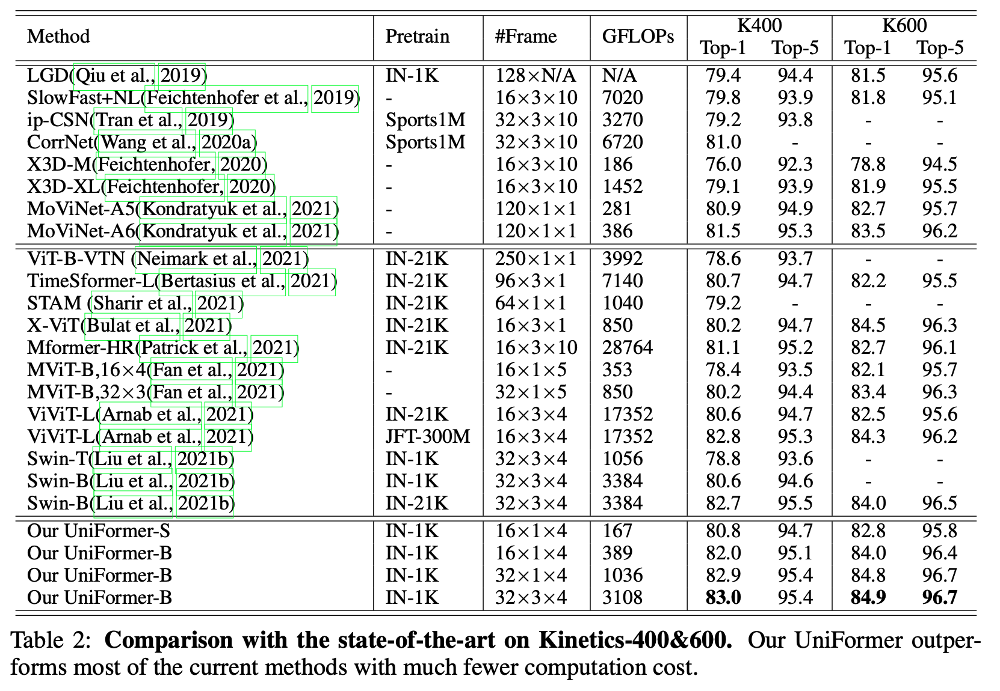

下图: 在 Something-Something V1 和 Something-Something V2 上**达到 SOTA**.

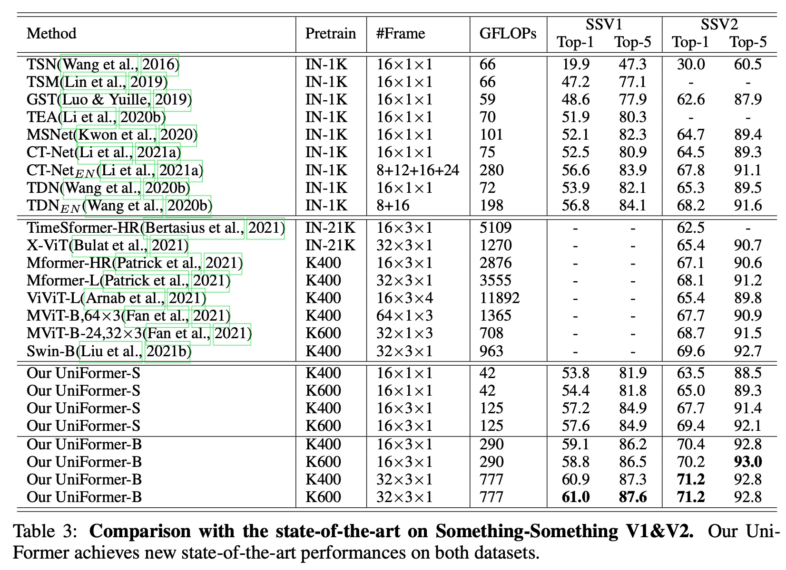

下图: 在计算代价和准确率之间的平衡. (横轴: 计算代价, 纵轴: 准确率)

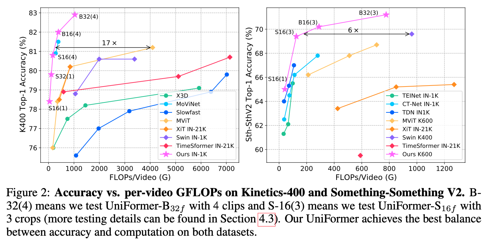

### 4.2 消融实验

下图: 消融实验.

- Unified 表示是否使用 local MHRA, Joint 表示是否使用 global MHRA, DPE 表示是否使用 DPE. ✖️ 表示使用 MobileNet 块.
- Type 中的 L/G 表示四层 Stage 分别使用 Local MHRA 还是 Global MHRA.

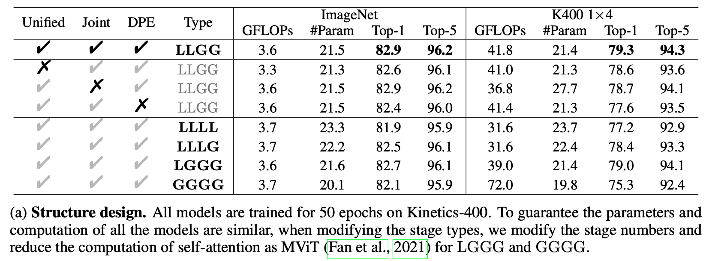

下图: Local MHRA 中 长方体感受野的敏感性.

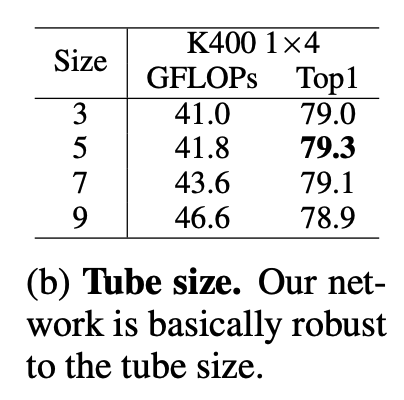

下图: 迁移学习的能力. 在 K400 上训练, 在 SSV1 上测试.

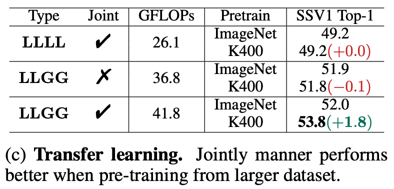

下图: 采样方法的敏感性. (帧数 $\times$ 时间步)

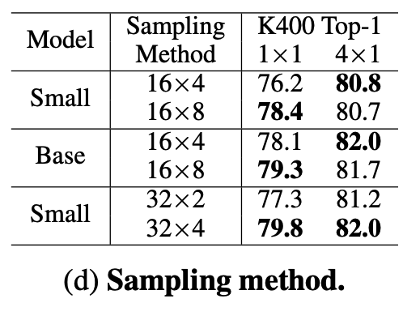

下图: Multi-clip/crop 实验.

[⚠️注: Multi-clip 指将视频按不同帧切分为多个视频, 对每个视频做分类, 然后将预测结果组合起来获得最终预测结果. Multi-clop 指将每一帧裁剪为不同的区域, 分别得到不同的多个视频, 然后将各视频的预测结果组合起来获得最终预测结果]

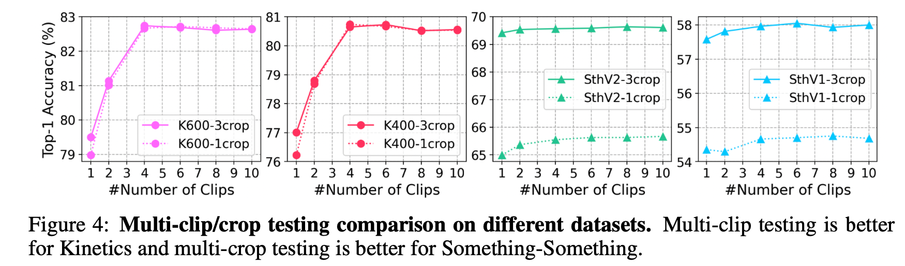

## 5. Conclusion (UniFormer)

主要创新点:

- 将 CNN 和 ViT 融合.
- 设计了 token 亲和力 $A_n$, 与自注意力有异曲同工之妙. 解决了自注意力机制盲目比较所有 token 的问题.

主要成果:

- 能同时处理局部冗余和全局冗余.
- 计算代价相对小.

---

## 6. Abstract (UniFormerV2)

- 学习**具有区分性的时空特征表示**是视频理解的关键问题.
- ViTs 通过自注意力展现了他们在**学习长视频依赖性**上的强大能力. 但不幸的是, 因为它们盲目地比较所有 tokens, **在处理局部视频冗余问题上展现出局限性**.
- UniFormer 通过在 transformer 架构中整合 CNNs 和自注意力为**关系聚合器 (relation aggregator)**, 成功地缓解了这一问题.
- 但是 UniFormer 在视频微调之前, 需要复杂的图像预训练步骤. 这限制了它的广泛应用.
- 与之相反, 大量开源的 ViTs 已经在丰富的图像监督下预训练.
- 基于这些观察, 我们通过结合预训练的 ViTs 和 UniFormer, 提出一种**搭建强大视频网络族**的**通用范式**. 我们称之为 UniFormerV2.
- 它包含了**全新的 local 和 global aggregators**, 并且通过集成 ViTs 和 Uniformer 的优点, 在计算代价和准确率上取得很好的平衡.
- UniFormerV2 在 8 个主流的视频 benchmarks 上获得了 SOTA 性能, 包括 K400/600/700 和 SSV1/V2. 它是第一个在 Kinetics-400 数据集上获得 90% top-1 准确率的模型.

## 7. Model (UniFormerV2)

### 7.1 Overview

- 动机: UniFormer 和 ViT 的对比

  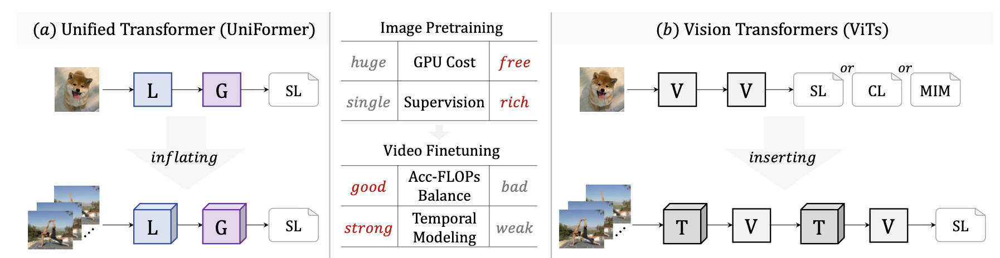

  - $L$ 是 Local MHRA, $G$ 是 Global MHRA, $T$ 是 Temporal MHSA.
  - SL 是有监督学习, CL 是对比学习, MIM 是 Mask Image Modeling.
  - ViTs 在**图像预处理**方面有优势, 而 UniFormer 在**视频微调**方面有优势.
  - 本模型旨在融合 ViTs 和 UniFormer 的优势.

- UniFormerV2 模型的设计和与 SOTA 的对比

  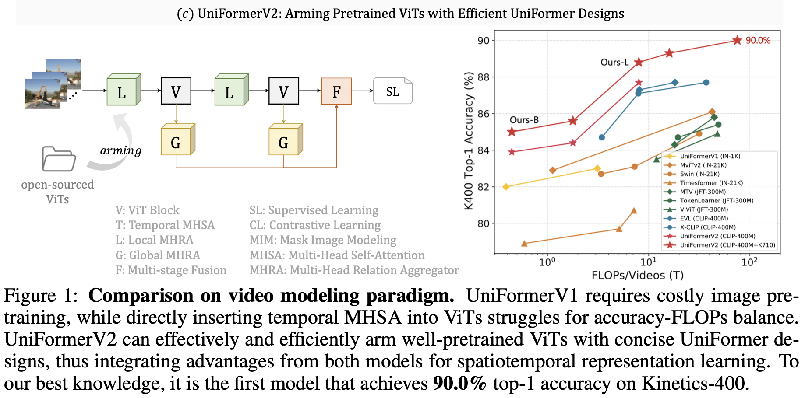

  比起 ViTs 的主要改进:

  - 将 Temporal MHSA 改为 Loacl MHRA.
  - 将 ViT 层的输出传给 Global MHRA 并将它们在最后融合.

下图: 模型框架.

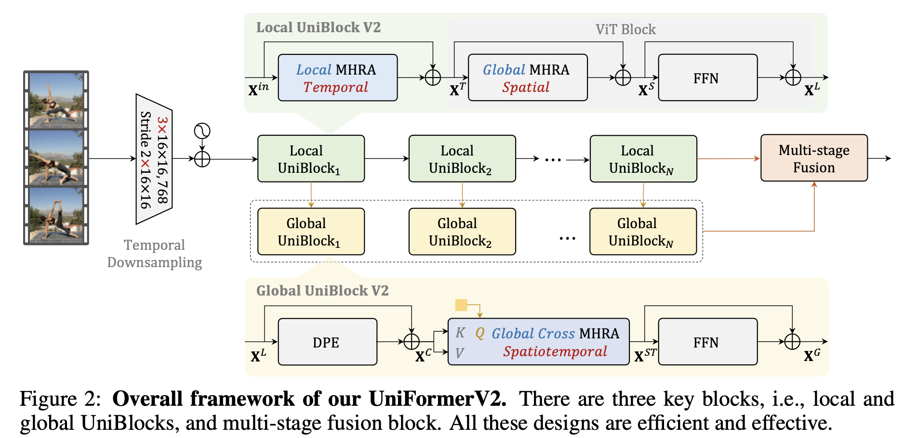

### 7.2 Local UniBlock

Local UniBlock 的行为:
$$
\textbf X^T=\text{LT\_MHRA}(\text{Norm}(\textbf X^{in}))+\textbf X^{in}
$$
其中, $\text{LT\_MHRA}(\cdot)$ 表示使用局部亲和力的 MHRA. 即 $A_n(\textbf X_i,\textbf X_j)$ 的计算方式为式 (12) (13).
$$
\textbf X^S=\text{GS\_MHRA}(\text{Norm}(\textbf X^T))+\textbf X^T
$$
其中, $\text{GS\_MHRA}(\cdot)$ 表示使用全局亲和力的 MHRA. 即 $A_n(\textbf X_i,\textbf X_j)$ 的计算方式为式 (14).
$$
\textbf X^L = \text{FFN}(\text{Norm}(\textbf X^S))+\textbf X^S
$$
[⚠️注: 留意到, Local UniBlock 的输入和输出形状是完全一样的.]

### 7.3 Global UniBlock

Global UniBlock 的行为:
$$
\textbf X^C=\text{DPE}(\textbf X^L)+\textbf X^L
$$
其中, $\text{DPE}(\cdot)$ 是 Dynamic Position Embedding, 同式 (4).
$$
\textbf X^{ST}=\text{C\_MHRA}(\text{Norm}(\textbf q), \text{Norm}(\textbf X^C))
$$
其中, $\text{C\_MHRA}(\textbf q,\cdot)$ 是互注意力风格的 MHRA. 它的第 $n$ 个**关系聚合器头 (Relation Aggregator)** $R_n^C(\textbf q,\cdot)$ 表示如下, 其中 $\textbf q\in\mathbb R^{1\times C}$ 是一个可学习的 query. [⚠️注: $\textbf q$ 的迭代和 Multi-stage Fusion 模块有关]
$$
R_n^{C}(\textbf q, \textbf X)=A_n^{C}(\textbf q, \textbf X)V_n(\textbf X)
$$
其中, $A_n^C(\textbf q,\textbf X)$ 是互注意力亲和力矩阵, 用于学习 $\textbf q$ 和 $\textbf X$ 的关系.其计算如下:
$$
A_n^C(\textbf q,\textbf X_j)=\frac
{\exp\left(
Q_n(\textbf q)^TK_n(\textbf X_j)
\right)}
{\sum_{j'\in\Omega^{T\times H\times W}}\exp\left(
Q_n(\textbf q)^TK_n(\textbf X_{j'})
\right)}
$$
其中, $V_n(\cdot)$, $Q_n(\cdot)$, $K_n(\cdot)$ 都是全连接层.

同式 (15), $\text{C\_MHRA}(\textbf q,\cdot)$ 的计算为:
$$
\text{C\_MHRA}(\textbf q, \textbf X)=\text{Concat}(R_1^C(\textbf q, \textbf X);R_2^C(\textbf q,\textbf X);\cdots;R_N^C(\textbf q,\textbf X))U
$$
最后, 计算 $\textbf X^G$:
$$
\textbf X^G=\text{FFN}(\text{Norm}(\textbf X^{ST}))+\textbf X^{ST}
$$

### 7.4 Multi-stage Fusion

这一模块的任务: 将 Local UniBlock 输出的 $\textbf X^L$ 和 Global UniBlock 输出的 $\textbf X^G$ 融合, 并更新 query $\textbf q$. 下图: 四种设计思路

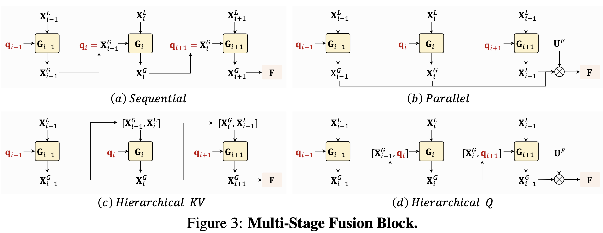

记第 $i$ 个 Global UniBlock 的输出为 $\textbf X_i^G=G_i(\textbf q_i, \textbf X_i^L)$.

- **Sequential 方式**: 更新 $\textbf q_i$ 为上一个 Global UniBlock 的输出, 即:
  $$
  \textbf q_1\gets \text{Random}()
  $$

  $$
  \textbf q_i = \textbf X_{i-1}^G
  $$

  $$
  \textbf X_i^G=G_i(\textbf q_i, \textbf X_i^L)=G_i(\textbf X_{i-1}^G, \textbf X_i^G)
  $$

  $$
  \textbf F =\textbf X_{N}^G
  $$

- **Parallel 方式**: 随机初始化所有的 $\textbf q_i$, concat 所有 $\textbf X^G_i$ 并映射到对应的形状, 即:
  $$
  \textbf q_1, \textbf q_2,\cdots,\textbf q_{N}\gets \text{Random}()
  $$

  $$
  \textbf X_i^G=G_i(\textbf q_i, \textbf X_i^L)
  $$

  $$
  \textbf F = \text{Concat}(\textbf X_1^G;\textbf X_2^G;\cdots;\textbf X_N^G)U^F
  $$

  其中, $U^F\in\mathbb R^{N\times C}$ 是可学习的.

- **Hierarchical KV 方式**: 随机初始化所有的 $\textbf q_i$, 但将上一个 Global UniBlock 的输出作为当前 Global UniBlock 的输入之一, 即:
  $$
  \textbf q_1, \textbf q_2,\cdots,\textbf q_{N}\gets \text{Random}()
  $$

  $$
  \textbf X_i^G=G_i(\textbf q_i, [\textbf X_{i-1}^G,\textbf X_i^L])
  $$

  $$
  \textbf F =\textbf X_{N}^G
  $$

- **Hierarchical Q 方式**: 随机初始化所有的 $\textbf q_i$, 但将上一个 Global UniBlock 的输出作为当前 Global UniBlock 的 $\textbf q$ 之一, 即:
  $$
  \textbf q_1, \textbf q_2,\cdots,\textbf q_{N}\gets \text{Random}()
  $$

  $$
  \textbf X_i^G=G_i(\textbf [\textbf X_{i-1}^G,q_i], \textbf X_i^L])
  $$

  $$
  \textbf F =\textbf X_{N}^G
  $$

实验表明, Sequential 方式和 Hierarchical Q 方式最有效 (见消融实验部分), 模型采用 Sequential 方式作为基准.

## 8. Experiment & Result (UniFormerV2)

### 8.1 和 SOTA 的对比

下图: 在 K400 上的性能比较.

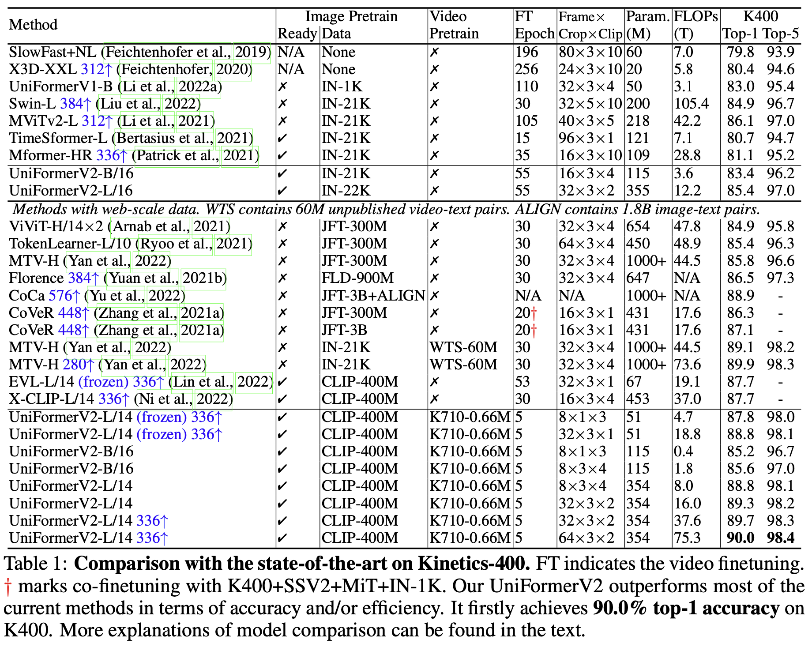

下图: 在 K600/700 上的性能比较.

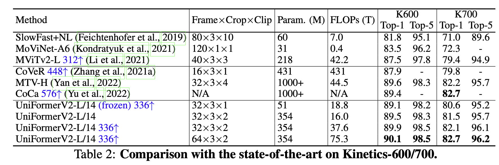

下图: 在 MiT V1 上的性能比较.

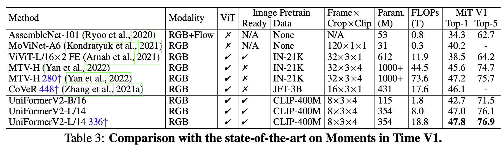

下图: 在 SSV2 上的性能比较.

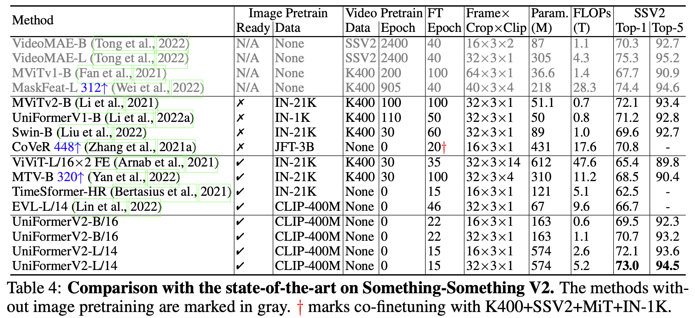

原文在 SSV1, ActivityNet, HACS 上也做了实验, 均达到了 SOTA.

### 8.2 消融实验

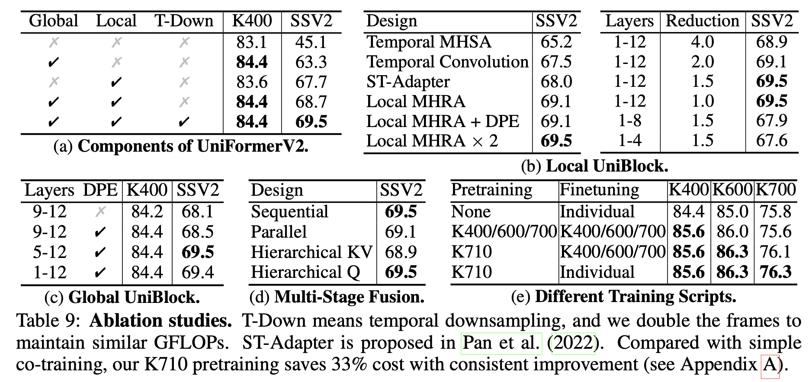

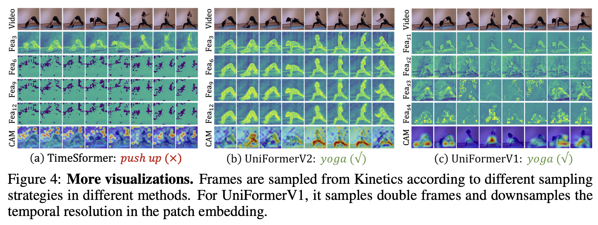

## 9. Conclusion (UniFormerV2)

主要创新点:

- 将 UniFormer 的设计放入 ViT 框架中.
- 为 $\textbf X^G$ 的融合设计了四种方式.

## 10. 总结

UniFormer 设计了**多头关系聚合器 (MHRA)**, 很好地处理了视频数据的**局部冗余**和**全局冗余**; UniFormerV2 在此基础上, 将 UniFormer 中大获成功的 MHRA 设计成块, 设计了 **Local UniBlock** 和 **Global UniBlock**, 并且设计了 **Global Cross MHRA**, 在 **Multi-stage Fusion** 中提出四种方式, 结合了 ViTs 的优点, 大大提高了视频理解的性能.
